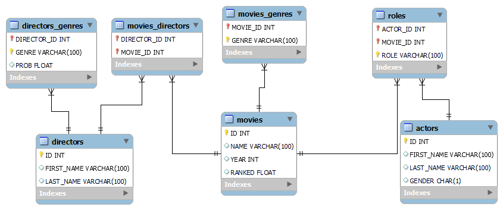

# JSON-to-MySQL Movie Database

The JSON-to-MySQL Movie Database project involves creating a relational database system using MySQL to store comprehensive information about movies, actors, directors, genres, and their relationships. The project also includes developing a Python script for uploading data from JSON files into the MySQL database.

Tables:

- ACTORS: This table stores information about actors.
- DIRECTORS: Contains data about movie directors.
- DIRECTORS_GENRES: A linking table that represents the many-to-many relationship between directors and genres.
- MOVIES: Stores details about movies, including their unique IDs, titles, year, and rakingss.
- MOVIES_GENRES: A linking table connecting movies with genres.
- ROLES: This table contains information about the roles actors play in movies.
- MOVIES_DIRECTORS: Another linking table that establishes the relationship between movies and directors.

Following the next ER DIAGRAM:




## Installation

Install python library

```bash
  pip install pandas
  pip install mysql.connector
  pip install tqdm
```
    
## Author

- [@Sebastian Hernandez](https://github.com/JuanSebastianHernandezGomez)

